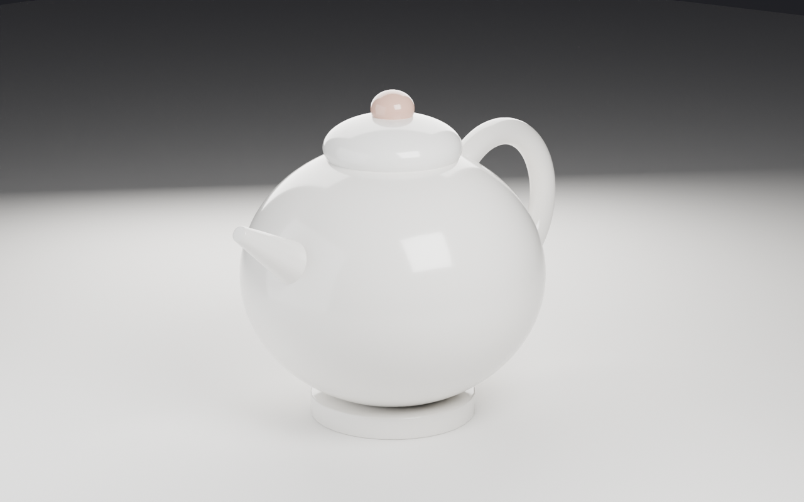
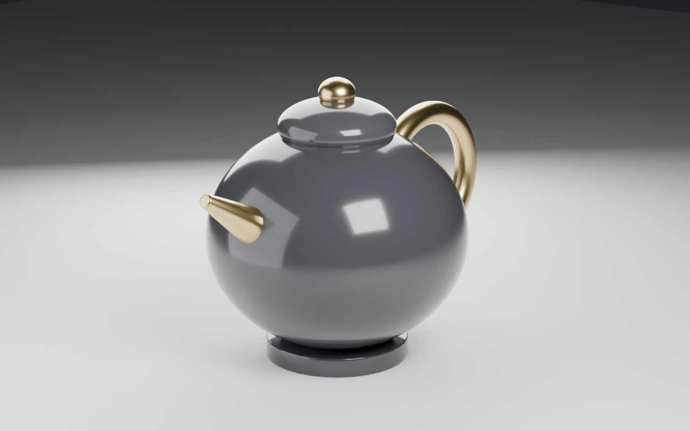

<h1 align="center">Ludwig</h1>

<p align="center"><b>An AI-native 3D design tool.</b><br>
Describe what you want — Ludwig writes the 3D scene as code, renders it,
<i>looks at the result</i>, critiques it, and iterates. No manual modeling.</p>

<p align="center">
  
  
</p>
<p align="center"><sub>Both images were generated from a single sentence — no human touched a vertex.<br>
"a luxury perfume bottle with a faceted glass body and a gold cap" · "a sculptural ceramic teapot, studio product render"</sub></p>

---

## The idea

Today a 3D design lives in an **opaque hand-built file**. To change "make the cap
gold and the bottle taller" you open a heavyweight app and push vertices for twenty
minutes. The file is a dead end: not diffable, not re-generatable, not steerable by
language.

Ludwig flips the source of truth to a **prompt + a generated, editable program**.
A design is code. "Make it taller" is a re-prompt. That makes designs
**re-generatable, diffable, and steerable by natural language** — something the
incumbent tools (Blender, Maya, Adobe, Autodesk) structurally cannot offer.

LLMs are mediocre at pushing vertices but *excellent* at writing code, so code is
the natural substrate for AI-native design.

## How it works

```
                 ┌──────────────────────────────────────────────┐
                 │                                              │
   prompt ──► Claude writes Blender Python ──► Blender renders a PNG
                 ▲                                              │
                 │     Claude *views* the render & critiques     │
                 └──────────  "the cap floats, light's flat" ◄──┘
                              regenerate N candidates, keep the best
```

Each round:

1. **Generate** `N` diverse candidate scenes — Claude writes Blender Python that
   calls Ludwig's realism toolkit (`L_pbr`, `L_lighting`, `L_autocam`, …).
2. **Render** each in headless Blender; void/empty frames are cheaply rejected
   before spending a critique.
3. **Critique** — Claude *views* every render and scores it like an art director.
4. **Keep the best**; if it clears the quality bar, stop. Otherwise regenerate
   variations informed by the winner's critique.
5. **Hero shot** — the winning scene is re-rendered in Cycles at high quality.

That self-correcting *visual* loop — generate code, look at the result, fix it — is
the core differentiator. No incumbent tool sees its own output and corrects it.

## Inference: bring your own Claude

Ludwig runs inference through the locally-authenticated **`claude` CLI** — there is
no API key to manage and nothing to pay per token. If you can run `claude`, you can
run Ludwig.

Inference is **pluggable**, though — Ludwig isn't wired to one vendor. `claude`
(the default) gives best-in-class intelligence; `--provider opencode` routes
through [opencode](https://opencode.ai) so you can bring **any** model
(Anthropic, OpenAI, Gemini, OpenRouter) or run a **free local** model via Ollama
(`export LUDWIG_MODEL=ollama/llama3.2-vision`). The orchestrator stays
provider-blind, so the same generate→render→critique loop runs on whatever brain
you point it at.

## Quickstart

```bash
# Requirements: Blender 5.x, the `claude` CLI (logged in), Python 3, Pillow
pip install -r requirements.txt

python3 ludwig.py "a sculptural ceramic teapot, clean studio product render"
python3 ludwig.py "a luxury perfume bottle with a gold cap" --candidates 3 --rounds 2

# verify your install end-to-end in ~2s (no API call): unit logic + a real
# Blender render through the toolkit, incl. that L_seat grounds the subject
python3 ludwig.py --selftest
```

Renders and the generated, editable `.py` scene scripts land in `renders/`. Blender
is auto-detected on macOS/Linux/Windows; override with `export BLENDER_PATH=...`.

| flag | meaning | default |
|------|---------|---------|
| `--candidates, -c` | scenes generated per round (the judge panel) | 3 |
| `--rounds, -r` | max refine rounds | 3 |
| `--target, -t` | stop when the best score ≥ this | 8 |
| `--workers, -w` | parallel candidate workers | 3 |
| `--quick, -q` | fast single-shot (1 candidate, 1 round) for iterating | off |
| `--agentic` | each candidate *views its own render* and self-corrects until it's good | off |
| `--agent-turns` | self-correction turns per agentic candidate | 2 |
| `--provider` | inference backend: `claude` (default) or `opencode` | claude |
| `--model` | model alias for inference (e.g. `opus`, `sonnet`, `haiku`) | configured |

## The file is a conversation

A render isn't a dead end — it's an **editable program you can re-prompt**. This is
the one thing a text-to-3D *mesh* (Meshy, Luma, Tripo) fundamentally cannot do:
you can't tell a mesh blob "make the third shelf deeper." You can tell Ludwig.

```bash
# take any generated scene and change it surgically — same scene, one edit
python3 ludwig.py --edit "make the teapot glossy charcoal ceramic with a brass spout, handle and knob" \
                  --from renders/a-sculptural-ceramic-teapot-clean-studio_r1_c0.py
```

<p align="center">
  
  <b>&nbsp;&nbsp;→&nbsp;&nbsp;</b>
  
</p>
<p align="center"><sub>Same scene, same lighting and composition — only the materials changed, in ~30 seconds.</sub></p>

The edit reuses the existing script and changes only what you asked for. That
editability — diffable, parametric, steerable by language — is the entire reason
the design-as-code architecture beats both the incumbents and the mesh generators.

## The realism toolkit

The generated code never hand-rolls materials or lights — it calls helpers from
[`ludwig_blender_lib.py`](ludwig_blender_lib.py), which is prepended to every scene:

- `L_pbr(name, color, kind)` — procedural PBR materials (wood, fabric, ceramic,
  metal, plaster, concrete, glass, leather, plastic).
- `L_lighting(mood)` — balanced light rigs (`golden_hour`, `sunset`, `midday`,
  `overcast`, `studio`, `dramatic`, `night`) that pair a warm key with a cool fill
  so colors survive instead of washing out.
- `L_studio_lights()` + `L_backdrop()` — a seamless "infinity cove" sweep and a
  3-point rig: the classic product-render set.
- `L_autocam(azimuth, elevation)` — auto-fits the subject in frame, eliminating
  the single most common failure (bad crops).
- `L_seat(*objs)` — drops a mesh (or a whole assembly, preserving its relative
  layout) onto the floor, killing the next most common failure: subjects that
  float above or sink into the ground.
- `L_bevel` / `L_apply` — bevel + smooth shading so edges catch light.

This is the moat in miniature: a reliable judge (the critic) tells us exactly which
capability to build next, and we build it into the toolkit.

## Roadmap

Ludwig starts in **3D viz / product rendering** (artists) and expands outward.

- [x] Generate → render → **vision critique** → self-repair loop
- [x] Multi-candidate judge panel + 5-axis rubric scoring + score-gated rounds
- [x] Realism toolkit: PBR materials, lighting presets, studio set, auto-framing
- [x] **`--edit`** — re-prompt an existing design (the editability moat)
- [x] Cross-platform Blender detection, retrying inference, preflight checks
- [ ] Richer geometry: curve/loft helpers, asset import, geometry nodes
- [ ] Live mode via [BlenderMCP](https://github.com/ahujasid/blender-mcp) — watch edits in real time
- [ ] Web product surface: prompt box, gallery, version diffs, "regenerate this part"
- [ ] **Architecture** vertical — parametric buildings + drawings via IFC / Grasshopper
- [ ] **Engineering** vertical — mechanical CAD via CadQuery/build123d → STEP → fabrication

## Why open source (and how it makes money)

Ludwig is **open-core**. The engine and toolkit are Apache-2.0 — that drives
adoption, community integrations, and trust. The business is the *hosted* service:
cloud inference, collaboration, a managed render farm, asset libraries, and team
features. Own the core's mindshare; monetize the cloud.

## Contributing

See [CONTRIBUTING.md](CONTRIBUTING.md). The highest-leverage contributions right
now are new `L_*` toolkit capabilities — each one lifts the quality of *every*
render.

## License

[Apache-2.0](LICENSE).
